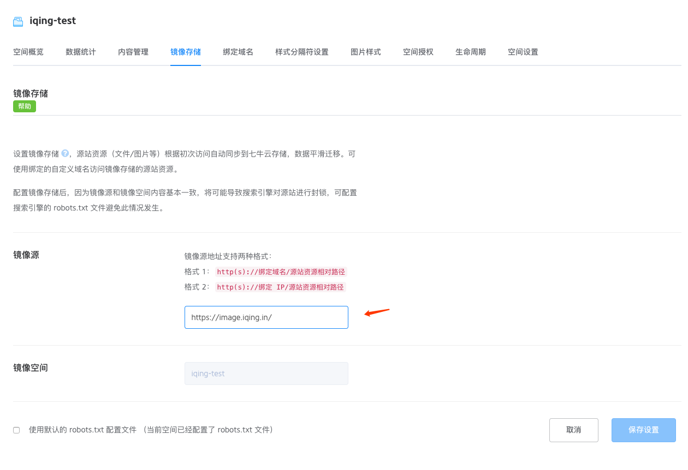
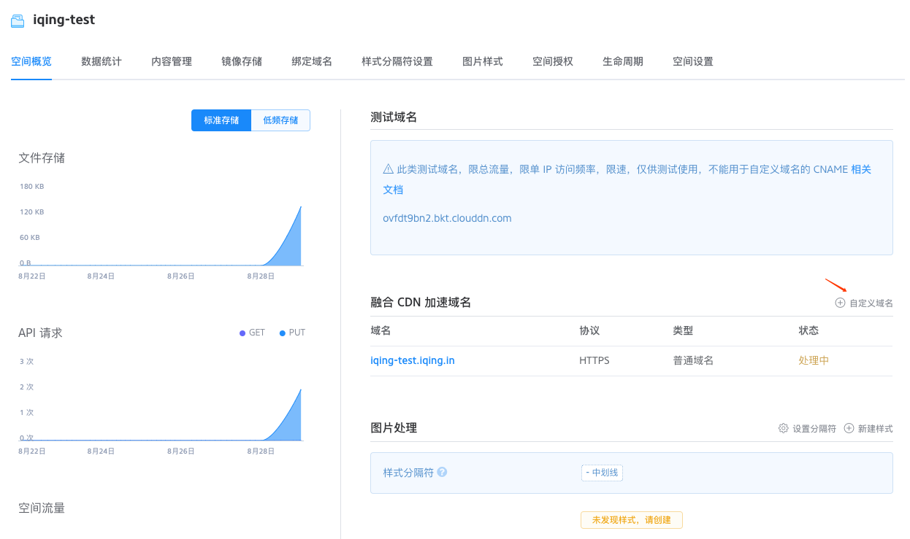

# 演绘部署文档

## 前言

使用演绘服务，可以自行部署演绘项目，也可以直接使用轻文提供的云服务。

本文档的目的，是为了描述如何自行部署演绘项目。

## 目标用户

本文档假设读者是具备足够运维部署能力的技术人员。

## 目录

* [部署静态资源](#部署静态资源)
  * [部署图片资源](#部署图片资源)
  * [部署音乐资源](#部署音乐资源)
  * [部署自定义数据处理](#部署自定义数据处理)
* [部署后端服务](#部署后端服务)
  * [后端架构](#后端架构)
* [部署游戏引擎服务器](#部署游戏引擎服务器)

## 部署静态资源

演绘的图片和音乐资源都是使用的七牛的全套解决方案，

首先在七牛注册账号：https://portal.qiniu.com/signup/choice

然后上传HTTPS证书：https://portal.qiniu.com/certificate/ssl#cert

如果不想使用七牛提供的CDN服务，可以省略上传HTTPS证书这个步骤。

## 部署图片资源

### 第一步，创建储存空间

https://portal.qiniu.com/bucket/create


区域选择华东，这样可以加速资源的同步，访问选择公开空间

### 第二步，设置镜像同步



镜像源输入image.iqing.in

### 第三步，设置域名



为了外部能够访问到储存空间里的资源，这里需要给库绑定域名。


如果不想使用七牛提供的CDN服务，通信协议选择HTTP，这样也不用上传ssl证书。


需要开启图片处理的功能。

## 部署音乐资源

部署音乐资源的方法和部署图片资源的方法基本一致。

唯一需要注意的是，镜像源改为sound.iqing.in。

## 部署自定义数据处理

### 第一步, 读取自定义数据处理docker镜像

```bash
# 假设当前目录为交接资源包根目录
cd qiniu-ufop-platform/src
# 构建docker镜像
docker build -t galgame-rip:v1 .
```

### 第二步, 下载安装命令行工具:

https://developer.qiniu.com/dora/tools/1222/qdoractl

通过使用该命令行工具，开发者能够创建、部署、维护、管理在数据处理V2上的自定义数据处理应用。

```bash
# 假设当前目录是你下载qdoractl的目录，先将文件改名
mv qdoractl-darwin-amd64-0.4.4 qdoractl
# 允许qdoractl被系统执行
chmod +x qdoractl
# 移动可执行文件到任何可以运行的地方
mv ./qdoractl /usr/local/bin/qdoractl
```

### 第三步, 使用qdoractl上传自定义数据处理

https://developer.qiniu.com/dora/manual/1224/quick-start

```bash
# 通过 qdoractl 工具登录您的七牛账号
qdoractl login
# 上传自定义处理镜像
qdoractl push galgame-rip:v1
```

### 第四步, 创建自定义数据处理

https://portal.qiniu.com/dora/create-ufopv2

自定义数据处理名称是整个七牛全局唯一的，建议按照按照${company}-ufopv的模式起名


# 部署后端服务

后端服务现在暂时由轻文轻小说托管运行。 下次发布会包括如何部署后端的方法。

## 后端架构

> 核心架构

后端服务由Django Web Server + Mysql构成

> 实际部署方法

Django Web Server被封装在Docker容器之中，这些容器由阿里云容器服务托管和构建。

```yml
# 编排模板
bilibili:
  image: 'registry-internal.cn-shenzhen.aliyuncs.com/iqing/bilibili-test:latest'
  command:
    - run
  restart: always
  environment:
    - WWW_ROOT_DIR=/wwwroot
    - WWW_WEB_DIR=/wwwroot/www
    - WWW_LOG_DIR=/wwwroot/log
    - PROJECT_NAME=bilibili
    - DJANGO_SETTINGS_MODULE=bilibili.settings_prodn
    - WORK_CLASS=17
  expose:
    - 22/tcp
    - 8080/tcp
  labels:
    aliyun.latest_image: true
    aliyun.scale: '20'
    aliyun.routing.port_8080: bilibili.iqing.in;bilibili;line5-h5-patch-iqing.bilibiligame.net
    aliyun.rolling_updates: 'true'
    aliyun.rolling_updates.parallelism: "10"
    aliyun.log_store_name: /wwwroot/log/bilibili-access-gunicorn.log
```

# 部署游戏引擎服务器

这一版的游戏引擎是部署在合作方的机器中，然后配置反向代理解决跨域问题。

```bash

server {
    listen  80;
    server_name line5-h5-patch-iqing.bilibiligame.net;

    location / {
        root /www/engine; # 交付包的engin文件夹复制到这里
    }

    location /account/bilibili_login/ {
        proxy_pass http://bilibili.iqing.in/bilibili_login/;
    }

    location /ngame/ {
        proxy_pass http://bilibili.iqing.in/ngame/;
    }
}
```

## 参考资料
* [七牛文档中心](https://developer.qiniu.com/)
* [Docker — 从入门到实践](https://yeasy.gitbooks.io/docker_practice/content/)
